<p align="center">
  
</p>
<h1 align="center">codec</h1>
<p align="center">
  The local workbench for a DevOps engineer's day —<br>
  read and check the YAML you live in (Kubernetes, Helm, Kustomize, Argo,<br>
  CI pipelines, Compose, Ansible), make sense of pipeline logs, and handle<br>
  the tokens, hashes, timestamps, cron schedules and regexes around them.<br>
  One binary, a local web UI and a CLI, next to your editor. Nothing leaves your machine.
</p>
<p align="center">
  <a href="https://github.com/mahasenabheetha/codec/actions/workflows/ci.yml"></a>
  <a href="https://github.com/mahasenabheetha/codec/releases"></a>
  <a href="LICENSE"></a>
  
  <a href="https://mahasenabheetha.github.io/codec/"></a>
</p>
<p align="center">
  <a href="https://mahasenabheetha.github.io/codec/"><b>Documentation</b></a> ·
  <a href="https://github.com/mahasenabheetha/codec/releases">Download</a> ·
  <a href="#quick-start">Quick start</a> ·
  <a href="https://mahasenabheetha.github.io/codec/cli.html">CLI reference</a>
</p>

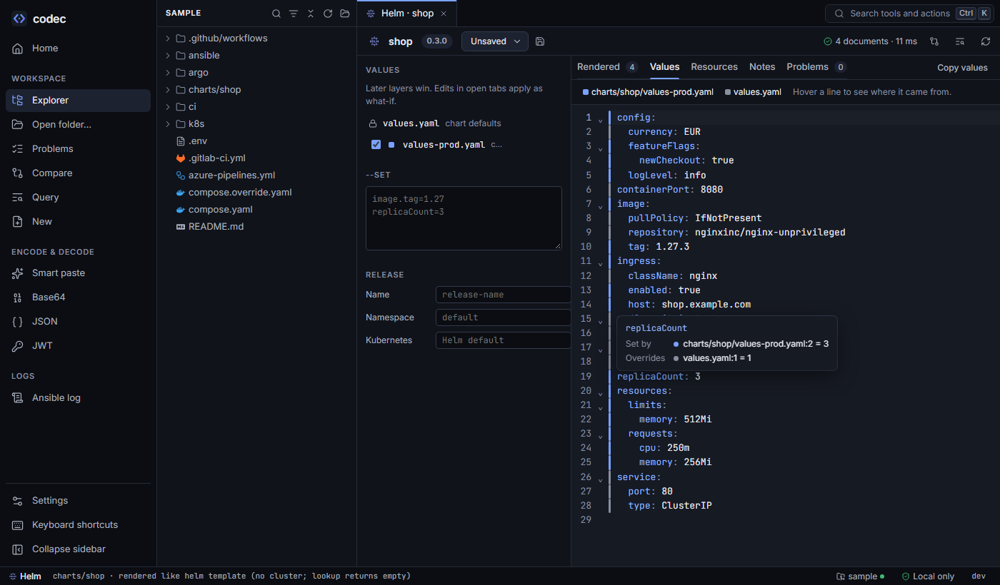

## Why codec

Most of a platform engineer's day is spent *reading* YAML: what this
chart renders with the prod values, which job runs after which, where an
Ansible variable is really set, what an Argo step receives. The answers
usually need a cluster, a pipeline run or a lot of scrolling. codec
answers them from the files alone, on your machine.

The rest of the day is small jobs around that YAML: why a pipeline's
Ansible run failed, what a JWT or a base64 Secret value says, when a
cron schedule really fires, whether a regex matches, a bcrypt line for
basic auth. They usually send you to a website — with your tokens and
passwords. codec does them locally, next to the files they belong to.

- **Understand, don't just edit** — see each file the way the tool that
  runs it does: Helm's merged values, GitLab's effective job after
  `extends`, Compose's merged services, Ansible's execution order.
- **Try things safely** — edits are *what-if*: they change what you see,
  never the file. Copy the result, or a patch `git apply` accepts.
- **Explain every problem** — each finding says why it matters and how to
  fix it, on the exact line.
- **One place for the small jobs** — logs, encodings, hashes, secrets,
  timestamps, cron and regex, in the same app and the same CLI.
- **Private by design** — never writes to your files, nothing you paste
  is stored, no telemetry, listens on `127.0.0.1` only. Works offline.

## Features

<table>
<tr>
<td width="50%"><b>Helm</b><br>Render charts exactly like <code>helm template</code> with the embedded Helm 4 SDK — no helm install, no cluster. Layer values files, save profiles, and see which file set every value.<br><a href="https://mahasenabheetha.github.io/codec/helm.html">Helm guide →</a></td>
<td width="50%"></td>
</tr>
<tr>
<td>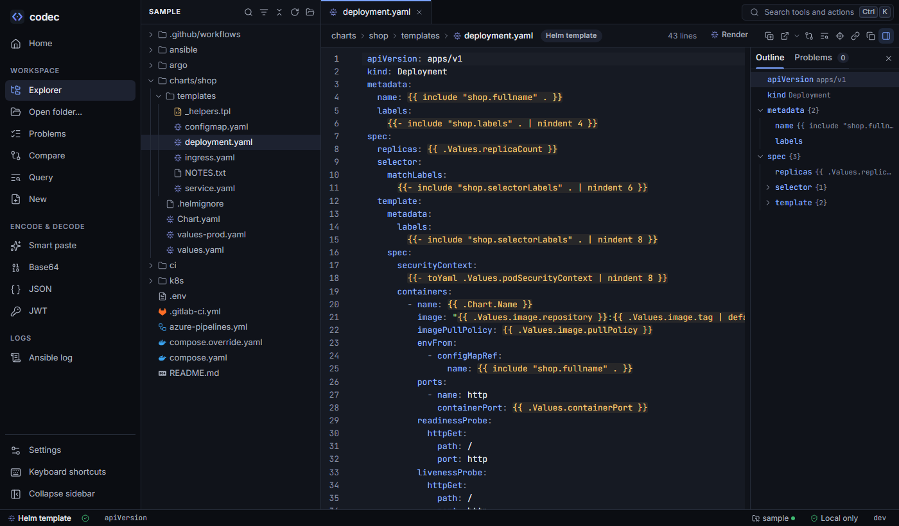</td>
<td><b>Workspace and editor</b><br>Open a repo read-only; every YAML file labelled by type. An editor that understands Helm, Jinja, GitHub and Argo expressions, with plain-English errors, hover, go to definition, schema completion and snippets.<br><a href="https://mahasenabheetha.github.io/codec/workspace.html">Workspace guide →</a></td>
</tr>
<tr>
<td><b>Lint and schemas</b><br>YAML 1.1 traps, risky Kubernetes settings, removed APIs for your target version, and schema validation for Kubernetes, CRDs, GitHub Actions, GitLab CI, Azure Pipelines and Compose — in the editor, across the repo and in CI.<br><a href="https://mahasenabheetha.github.io/codec/lint.html">Lint guide →</a></td>
<td>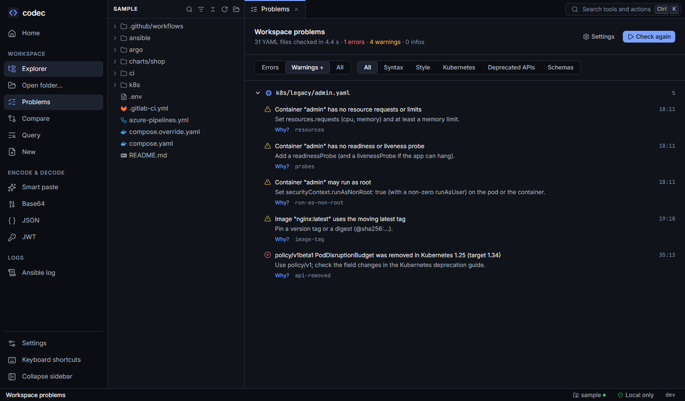</td>
</tr>
<tr>
<td>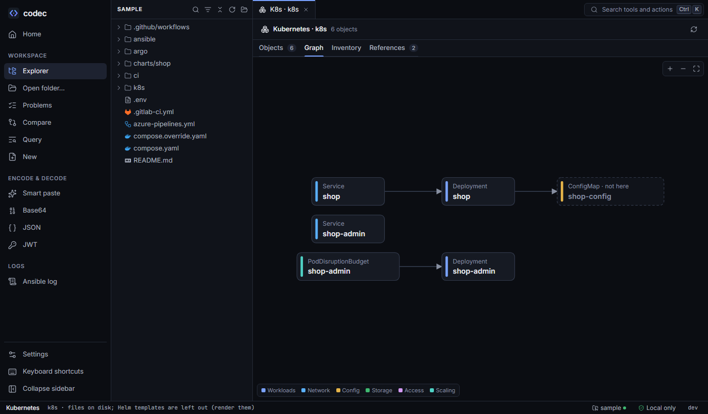</td>
<td><b>Kubernetes and Kustomize</b><br>Manifests, renders and builds as cards, a relationship graph, an inventory and broken references. Kustomize builds in-process, identical to <code>kubectl kustomize</code>.<br><a href="https://mahasenabheetha.github.io/codec/kubernetes.html">Kubernetes guide →</a></td>
</tr>
<tr>
<td><b>Argo</b><br>Workflows as graphs, every step's template and inputs resolved across files; <code>when</code> and <code>depends</code> evaluated; run-time values marked, never guessed. Argo CD apps rendered with their values.<br><a href="https://mahasenabheetha.github.io/codec/argo.html">Argo guide →</a></td>
<td>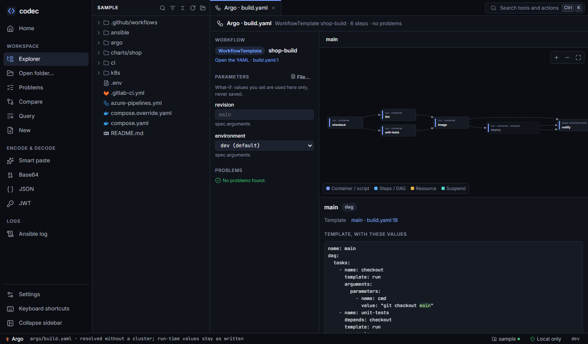</td>
</tr>
<tr>
<td>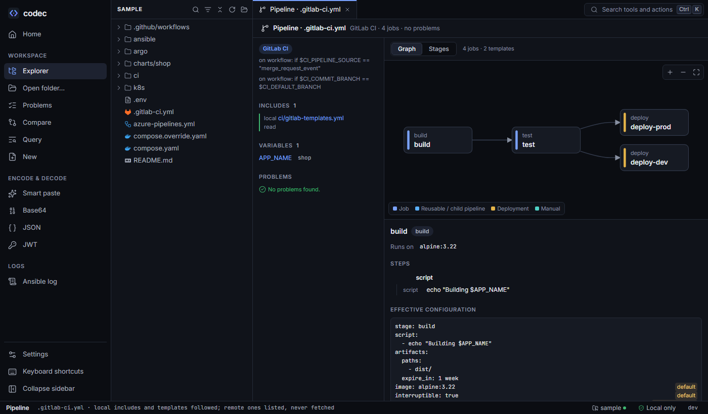</td>
<td><b>CI pipelines</b><br>GitHub Actions, GitLab CI and Azure Pipelines in execution order, every matrix combination, and each job's effective configuration with the origin of every line.<br><a href="https://mahasenabheetha.github.io/codec/ci.html">CI guide →</a></td>
</tr>
<tr>
<td><b>Compose and Ansible</b><br>Compose files merged like <code>docker compose config</code>, variables from <code>.env</code>, services as a graph. Playbooks in the order Ansible runs them, roles in place, variables ranked by precedence, and a playbook map coloured by a run from a log.<br><a href="https://mahasenabheetha.github.io/codec/compose.html">Compose</a> · <a href="https://mahasenabheetha.github.io/codec/ansible.html">Ansible</a></td>
<td>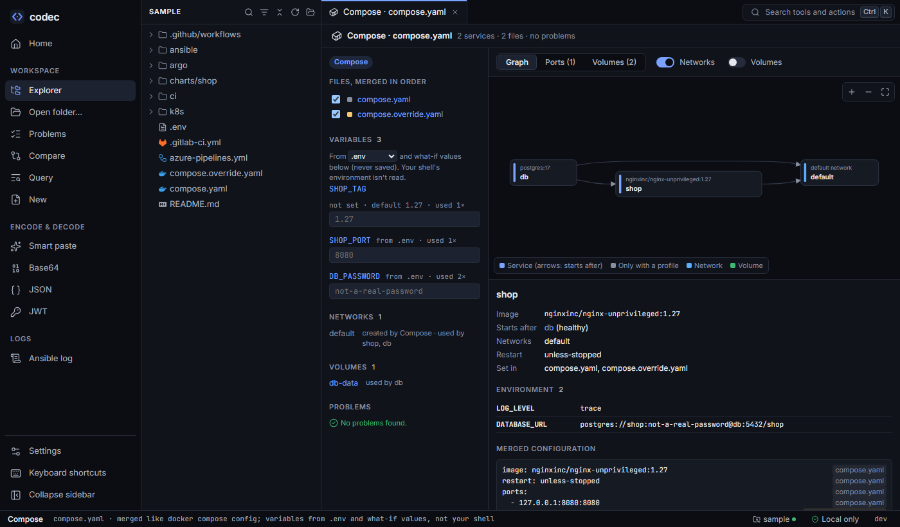</td>
</tr>
<tr>
<td>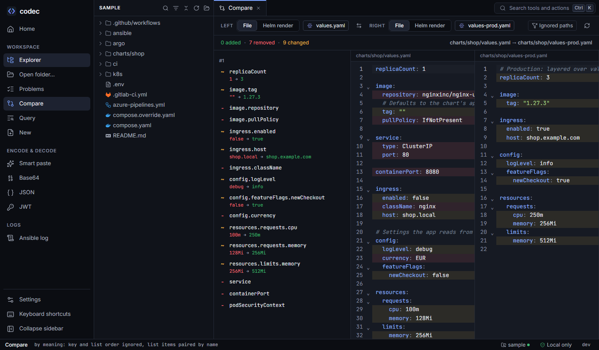</td>
<td><b>Compare, query and search</b><br>Diff by meaning — key and list order ignored, containers paired by name — including dev vs prod renders, or pasted text such as a live object. Run jq over the whole repo, or Find in Files for plain text, and jump to each result.<br><a href="https://mahasenabheetha.github.io/codec/compare.html">Compare guide →</a></td>
</tr>
<tr>
<td><b>New files and clones</b><br>Starters with a short form, linted and rendered before you copy them; your own team starters; clone a file under a new name with references renamed and everything else listed.<br><a href="https://mahasenabheetha.github.io/codec/new.html">Starters guide →</a></td>
<td>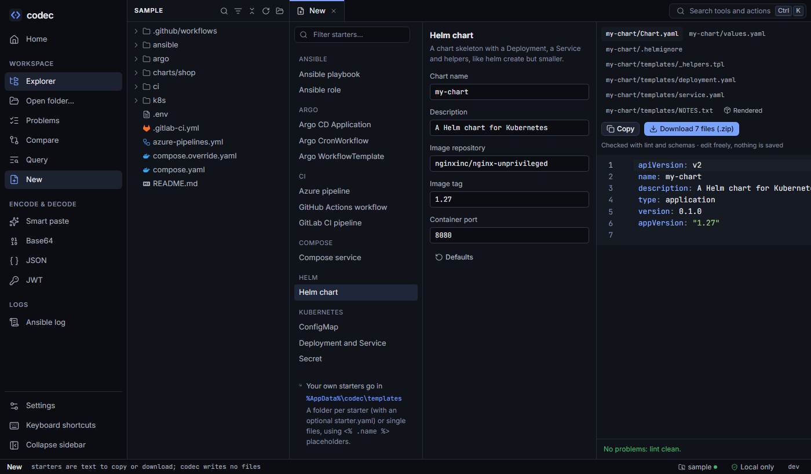</td>
</tr>
<tr>
<td>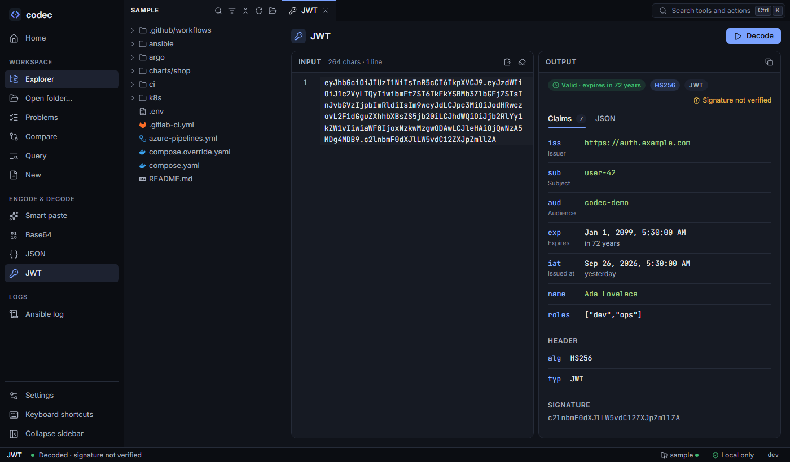</td>
<td><b>Logs and everyday tools</b><br>Ansible logs, from one failed task to a whole pipeline log with several runs: the failure, its probable cause and where the task is defined. Smart paste, base64, JSON and JWT claims. Under <b>Utilities</b>: URL and hex encoding, hashes and HMAC, random secrets and UUIDs, htpasswd lines, timestamps, cron schedules in plain words with their next runs (also on hover in CronJobs and pipelines), and a regex tester that explains the pattern.<br><a href="https://mahasenabheetha.github.io/codec/tools.html">Tools guide →</a></td>
</tr>
</table>

## Quick start

Download the archive for your platform from
[Releases](https://github.com/mahasenabheetha/codec/releases) (Windows,
macOS, Linux; amd64 and arm64), unpack it, and run:

```bash
codec serve --open --sample
```

Your browser opens codec on a small made-up repository with one of
everything, landing on its rendered Helm chart. Then open your own:

```bash
codec serve --open --root path/to/your/repo
```

The CLI needs no installer and no admin rights. On Windows, SmartScreen may warn about the
unsigned binary (*More info → Run anyway*); on macOS run
`xattr -d com.apple.quarantine codec` once.
[Getting started](https://mahasenabheetha.github.io/codec/getting-started.html)
has the details.

### Desktop app (Windows)

The same codec in its own window, with a tray icon. From
[Releases](https://github.com/mahasenabheetha/codec/releases), run
`codec-desktop_<version>_windows_amd64_setup.exe`. It installs for you
alone, without admin rights, adds a Start menu entry and offers codec in
Explorer's *Open with* for YAML files. The portable
`codec-desktop_<version>_windows_amd64.exe` runs without installing.
Closing the window keeps codec in the tray; *Settings → Desktop* turns
on Start at login. macOS follows later.

### Docker

```bash
docker run --rm -p 127.0.0.1:8765:8765 -v "$PWD:/work:ro" ghcr.io/mahasenabheetha/codec
```

Open http://localhost:8765. The repository is mounted read-only; add
`-v codec-home:/home/nonroot` to keep settings between runs.

### From source

Go 1.26+ and Node.js 22+:

```bash
git clone https://github.com/mahasenabheetha/codec.git && cd codec
npm --prefix frontend ci && npm --prefix frontend run build
go build -o codec ./cmd/codec
```

## CLI

The UI and the CLI share one engine, so everything works in a terminal
and in CI. Exit code 2 means findings.

```bash
codec yaml lint deploy/ charts/ --k8s-version 1.31      # lint + schemas, a CI gate
codec helm values ./charts/shop -f values-prod.yaml --provenance
codec kustomize build overlays/prod                     # no kubectl needed
codec ci job .gitlab-ci.yml deploy-prod                 # effective config, origin per line
codec argo resolve argo/ -p environment=prod            # every step and its inputs
codec yaml diff dev.yaml prod.yaml                      # by meaning
codec yaml query '.spec.template.spec.containers[].image' .
codec search -w replicas charts/                        # text in every listed file
codec cron '*/15 2-6 * * 1-5' --zone Europe/Stockholm  # plain words, next runs
codec regex --explain '^v(\d+)\.(\d+)$'                 # a pattern part by part
```

All commands: [CLI reference](https://mahasenabheetha.github.io/codec/cli.html).

## How it works

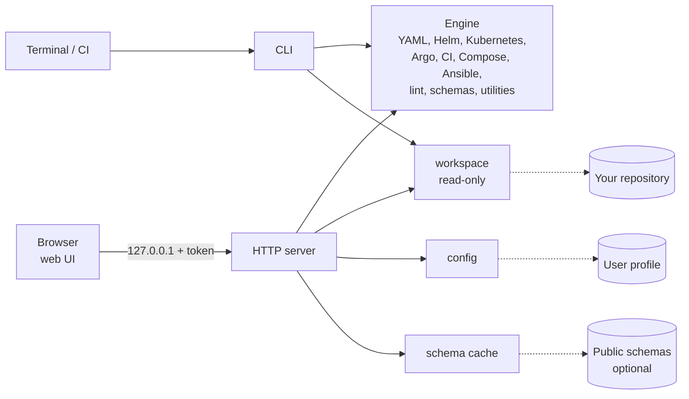

A single Go binary embeds the Svelte UI. The engine is pure — it only
reasons about text it is given — and adapters do all input and output,
so the UI and the CLI always agree. More in
[Architecture](https://mahasenabheetha.github.io/codec/architecture.html)
and [Flows](https://mahasenabheetha.github.io/codec/flows.html).

## Documentation

- [Getting started](https://mahasenabheetha.github.io/codec/getting-started.html) — install, the sample, your repo, Docker
- Guides for every view: [workspace](https://mahasenabheetha.github.io/codec/workspace.html),
  [Helm](https://mahasenabheetha.github.io/codec/helm.html),
  [lint](https://mahasenabheetha.github.io/codec/lint.html),
  [Kubernetes](https://mahasenabheetha.github.io/codec/kubernetes.html),
  [Argo](https://mahasenabheetha.github.io/codec/argo.html),
  [CI](https://mahasenabheetha.github.io/codec/ci.html),
  [Compose](https://mahasenabheetha.github.io/codec/compose.html),
  [Ansible](https://mahasenabheetha.github.io/codec/ansible.html),
  [compare and query](https://mahasenabheetha.github.io/codec/compare.html),
  [new files](https://mahasenabheetha.github.io/codec/new.html),
  [tools](https://mahasenabheetha.github.io/codec/tools.html)
- [CLI reference](https://mahasenabheetha.github.io/codec/cli.html) ·
  [keyboard shortcuts](https://mahasenabheetha.github.io/codec/shortcuts.html) ·
  [troubleshooting](https://mahasenabheetha.github.io/codec/troubleshooting.html)
- [Security and privacy](https://mahasenabheetha.github.io/codec/security.html) ·
  [design language](https://mahasenabheetha.github.io/codec/design.html)

The site's source is in [`docs/`](docs/) (plain HTML, also readable offline).

## Contributing

Issues and pull requests are welcome — see [CONTRIBUTING.md](CONTRIBUTING.md).
Contributors and AI agents start at [AGENTS.md](AGENTS.md); how the
project is built and changed is in [design/](design/README.md).
Report security problems privately: [SECURITY.md](SECURITY.md).
Changes are listed in [CHANGELOG.md](CHANGELOG.md).

## License

[MIT](LICENSE) © Mahasen Abheetha

## Acknowledgements

This project was developed as a hands-on Go learning journey by
[Mahasen Abheetha](https://github.com/mahasenabheetha), with development
assistance from **Claude (Anthropic)** used as a pair-programming and
teaching tool. Design decisions, code review, and explanations were
AI-assisted; the learning was not.
